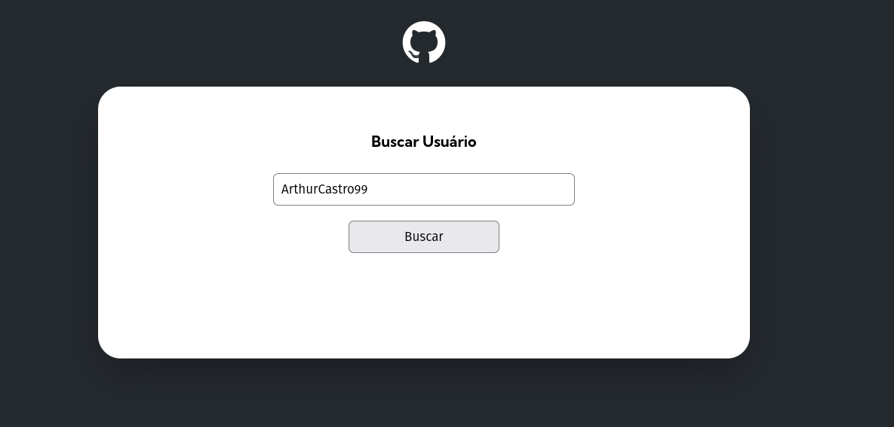
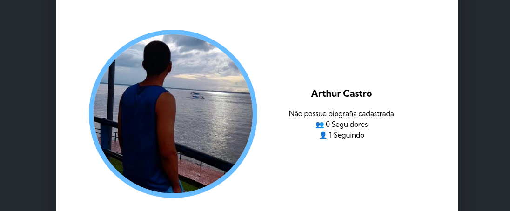
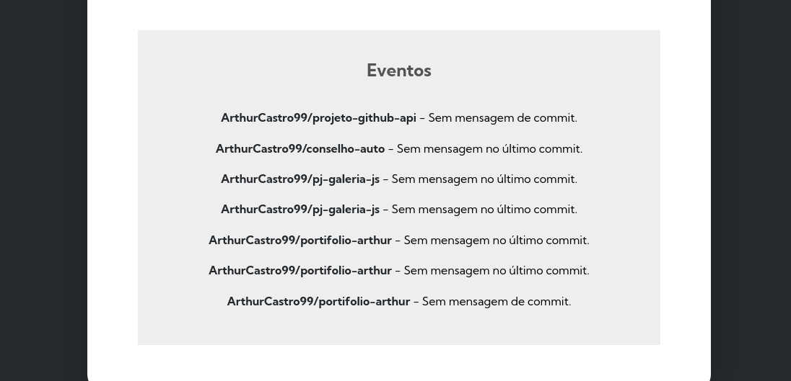

# projeto-fetch-github-api

### Opa Tudo Bem?

Eu sou [Arthur](https://drive.google.com/file/d/1DMee-tcR2M0huWUorfRSPmy2G5Rie5lZ/view?usp=sharing) desenvolvedor Frontend.

## Sobre o Projeto

Projeto do curso [DEVQUEST](https://devquest.curseduca.pro) em que o objetivo e buscar um usuário do [GitHub](https://github.com/) pela [API](https://api.github.com/) do próprio [GitHub](https://github.com/) e mostra o perfil, biográfia, seguidores, quantos usuários ele está seguindo, repositórios com forkes, stars, watches e language utilizada, além de buscar os ultimos 10 eventos do usuários.

## Tecnologias Utilizadas

- HTML
- CSS
- JS

## Tranquilo ? 🤯

Se quiser experimentar dentro do site que o github disponibiliza fique a vontade e fique a vontade para baixar o projeto. Eu sempre deixo projetos públicos livres para aprimorarem.

## 📸 Exibição

## 🧠 Aprendizados / Detalhes

Bem uma experiência muito agradavel, pois esse foi uns dos projetos que me fez fazer bastante pesquisas de [JavaScript](https://www.w3schools.com/js/default.asp) apesar de está me acustumando acabei descobrindo alguns códigos novos e melhor que isso eu aprendi com eles. Eu finalmente conseguir ler tudo e entender tudo que eu completei no projeto, pois o projeto e uma continuação de uma aula. A parte mais legal durante esse trabalho foi a busca de cada código especifico da [API](https://api.github.com/), já que por causa disto me familiarizei mais com as pastas nas raiz do [VSCODE](https://code.visualstudio.com/) e até mesmo a entender as busca dentro das APIs que foi uma nova experiência para mim.
Por fim vale ressaltar os ensinametos dentro do curso e até mesmo as pesquisas fora, pois não e bom depender apenas de uma fonte, ainda mas se você quer aprender e melhorar, mas tenho a agradecer ao curso que me direciona um caminho.

## 📬 Contato

Eu gosto muito de ouvir e ler opiniões que me ajudam a aprender e evoluir, então se você estiver algo para falar sobre, me envie mensagem por um desses links :

📱 : [**Instagram**](https://www.instagram.com/arthurcastro_99/)

💻 : [**Linkedin**](https://www.linkedin.com/in/arthur-castro-b70a02223/)